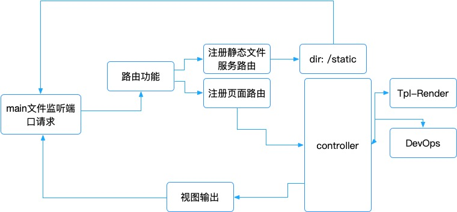

<p align="center">
  <a href="#">
    
  </a>
</p>

# [Go语言俱乐部](http://golangclub.com)

## 灵感来源

http://go.dev


## 执行逻辑





## 结构

```
.
├── LICENSE
├── Makefile
├── README.md
├── config
│   └── config.toml     # 配置文件
├── global
│   ├── app.go
│   └── init.go
├── go.mod
├── go.sum
├── http
│   ├── controller      
│   │   ├── index.go    # 页面路由
│   │   ├── repo.go     # DevOps
│   │   └── routes.go   # 路由注册
│   ├── funcs.go        # 模板函数
│   └── http.go         # 模板渲染
├── main.go             
├── static              # 静态资源文件
│   ├── css
│   ├── imgs
│   └── js
├── template            # 模板
│   ├── about.html
│   ├── common
│   │   └── layout.html
│   ├── gopher.html
│   ├── index.html
│   ├── learn.html
│   ├── solution.html
│   └── solutions
│       ├── clis.html
│       └── webdev.html
├── util
│   └── file.go
└── vendor
```


